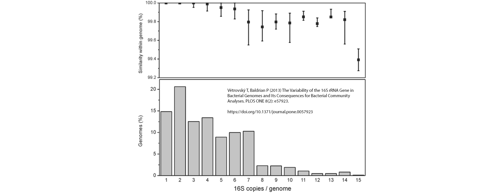

## MarkerMAG (link MAGs with marker genes)

 

Contact
---

+ **Weizhi Song**, Postdoctoral Researcher
+ Center for Marine Science & Innovation, University of New South Wales, Sydney, Australia
+ E-mail: songwz03@gmail.com

Dependencies
---

+ Python libraries: 
[BioPython](https://github.com/biopython/biopython.github.io/), 
[Pandas](https://pandas.pydata.org)

+ R packages: 
[optparse](https://cran.r-project.org/web/packages/optparse/index.html),
[googleVis](https://cran.r-project.org/web/packages/googleVis/index.html)

+ Third-party software: 
[BLAST+](https://blast.ncbi.nlm.nih.gov/Blast.cgi?PAGE_TYPE=BlastDocs&DOC_TYPE=Download), 
[Bowtie](http://bowtie-bio.sourceforge.net/bowtie2/index.shtml)

How to install:
---

MarkerMAG can be installed via `pip3`:

    # First-time installation
    pip3 install MarkerMAG
        
    # for upgrade
    pip3 install --upgrade MarkerMAG

How to run:
---
 
1. MarkerMAG assumes the id of paired reads in a format of XXXX.1 and XXXX.2. The only difference is the last character.
You can rename your reads with "MarkerMAG rename_reads". 
Please note that all reads in R1.fasta and R2.fasta must be in pair and their orders in the files must be the same.

       MarkerMAG rename_reads -r1 R1.fasta -r2 R2.fasta -p Soil
        
       # output files name and renamed reads id:
       # Soil_R1.fasta: soil_1.1, soil_2.1, soil_3.1 ...
       # Soil_R2.fasta: soil_1.2, soil_2.2, soil_3.2 ...
    
1. Link 16S rRNA gene sequences with MAGs: 

       MarkerMAG link -p Test -r1 R1.fasta -r2 R2.fasta -m 16S_seqs.fa -mag MAG_filess -x fa -t 4

1. Link 16S rRNA gene sequences with metagenomic assemblies: 

       MarkerMAG link -p Test -r1 R1.fasta -r2 R2.fasta -m 16S_seqs.fa -g contig.fasta -t 4
    
Output files:
---

    MarkerGene	GenomicSeq	Paired	Clipping	Intersection
    MarkerGene__s4_02579	GenomicSeq__s4	40	27	yes
    MarkerGene__s4_04216	GenomicSeq__s4	97	39	yes
    MarkerGene__o2_01394	GenomicSeq__o2	18	0	no
    MarkerGene__s4_00580	GenomicSeq__s4	84	41	yes
    MarkerGene__p4_02304	GenomicSeq__p4	0	43	no
    MarkerGene__g4_00414	GenomicSeq__g4	196	139	yes
    MarkerGene__o3_02626	GenomicSeq__o3	100	81	yes

Reference: intra-genome 16S rRNA gene divergence [[ref.]](https://doi.org/10.1371/journal.pone.0057923)
---

 

