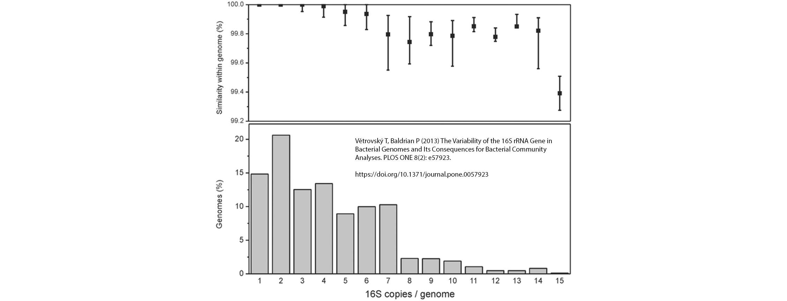

## MarkerMAG (link MAGs with marker genes)

 

Contact
---

+ **Weizhi Song**, Postdoctoral Researcher
+ Center for Marine Science & Innovation, University of New South Wales, Sydney, Australia
+ E-mail: songwz03@gmail.com

Dependencies
---

+ Python libraries: 
[BioPython](https://github.com/biopython/biopython.github.io/), 
[Pandas](https://pandas.pydata.org)

+ R packages: 
[optparse](https://cran.r-project.org/web/packages/optparse/index.html),
[googleVis](https://cran.r-project.org/web/packages/googleVis/index.html)

+ Third-party software: 
  + [BLAST+](https://blast.ncbi.nlm.nih.gov/Blast.cgi?PAGE_TYPE=BlastDocs&DOC_TYPE=Download), 
    [Bowtie2](http://bowtie-bio.sourceforge.net/bowtie2/index.shtml)
  + [Usearch](https://www.drive5.com/usearch/) (required by uclust_16S module)

How to install:
---

MarkerMAG can be installed via `pip3`:

    # First-time installation
    pip3 install MarkerMAG
        
    # upgrade
    pip3 install --upgrade MarkerMAG

How to run:
---
1. MarkerMAG modules
 
            ...::: MarkerMAG v1.0.9 :::...

        link          ->  link MAGs with marker genes
        rename_reads  ->  rename paired reads (in fasta format) 
        uclust_16S    ->  cluster marker genes with Usearch
    

1. MarkerMAG assumes the id of paired reads in a format of XXXX.1 and XXXX.2. The only difference is the last character.
You can rename your reads with "MarkerMAG rename_reads". 
Please note that all reads in R1.fasta and R2.fasta must be in pair and their orders in the files must be the same.

       MarkerMAG rename_reads -r1 R1.fasta -r2 R2.fasta -p Soil
        
       # output files name and renamed reads id:
       # Soil_R1.fasta: soil_1.1, soil_2.1, soil_3.1 ...
       # Soil_R2.fasta: soil_1.2, soil_2.2, soil_3.2 ...
    
1. Link 16S rRNA gene sequences with MAGs: 

       MarkerMAG link -p Test -r1 R1.fasta -r2 R2.fasta -m 16S_seqs.fa -mag MAG_filess -x fa -t 4

1. Link 16S rRNA gene sequences with metagenomic assemblies: 

       MarkerMAG link -p Test -r1 R1.fasta -r2 R2.fasta -m 16S_seqs.fa -g contig.fasta -t 4
    
Output files:
---

1. output table

       Marker	Genome	Paired	Clipping
       s4_04216	bin_s4	97	39
       o2_01394	bin_o2	18	0
       s4_00580	bin_s4	84	41
       g4_00414	bin_g4	196	139
       o3_02626	bin_o3	100	81

Reference: 
---

1. Intra-genome 16S rRNA gene divergence [[ref.](https://doi.org/10.1371/journal.pone.0057923)]
 

1. Other handy tools/scripts
   + [seqtk](https://github.com/lh3/seqtk): tool for processing sequences in the FASTA or FASTQ format.

