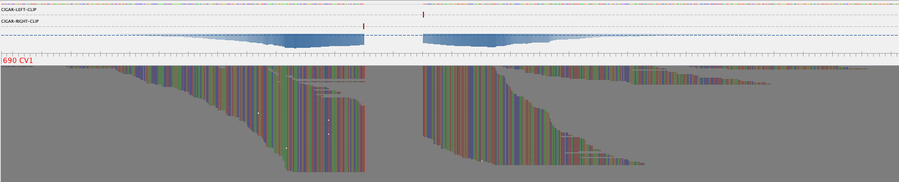

## MarkerMAG: linking MAGs with 16S rRNA marker genes using paired-end short reads

 

Publication
---

+ **Song WZ**, Zhang S, Thomas T* (2022) MarkerMAG: linking metagenome-assembled genomes (MAGs) with 16S rRNA marker genes using paired-end short reads, _Bioinformatics_. [https://doi.org/10.1093/bioinformatics/btac398](https://doi.org/10.1093/bioinformatics/btac398)
+ Contact: Dr. Weizhi Song (songwz03@gmail.com), Prof. Torsten Thomas (t.thomas@unsw.edu.au)
+ Center for Marine Science & Innovation, University of New South Wales, Sydney, Australia

Updates
---

+ 2022-05-08 - MarkerMAG is now available on Bioconda, please refers to "**How to install**" for details.
+ 2022-03-12 - A [demo dataset](https://doi.org/10.5281/zenodo.6466784) (together with command) has now been provided! You can use it to check if MarkerMAG is installed successfully on your system.

MarkerMAG modules
---

1. Main module

    + `link`: linking MAGs with 16S rRNA marker genes
    
1. Supplementary modules

    + `rename_reads`: rename paired reads ([manual](doc/README_rename_reads.md))
    + `matam_16s`: assemble 16S rRNA genes with Matam ([manual](doc/README_matam_16s.md))
    + `barrnap_16s`: identify 16S rRNA genes from genomes/MAGs with Barrnap ([manual](doc/README_barrnap_16s.md))

How to install
---

+ MarkerMAG is implemented in [python3](https://www.python.org), 
  It has been tested on Linux and MacOS, but NOT on Windows.

+ A Conda package that automatically installs MarkerMAG's third-party dependencies (except [Usearch](https://www.drive5.com/usearch/) :warning:) is now available. 
  Please note that you'll need to install [Usearch](https://www.drive5.com/usearch/) on your own as it's not available in Conda due to license issue.

      # install with 
      conda create -n MarkerMAG_env -c bioconda MarkerMAG
      
      # To activate the environment    
      conda activate MarkerMAG_env
      # MarkerMAG is ready for running now, type "MarkerMAG -h" for help
      
      # To deactivate the environment
      conda deactivate

+ It can also be installed with pip. Software dependencies need to be in your system path in this case. 
  Dependencies for the `link` module include 
  [BLAST+](https://blast.ncbi.nlm.nih.gov/Blast.cgi?PAGE_TYPE=BlastDocs&DOC_TYPE=Download), 
  [Barrnap](https://github.com/tseemann/barrnap), 
  [seqtk](https://github.com/lh3/seqtk), 
  [Bowtie2](http://bowtie-bio.sourceforge.net/bowtie2/index.shtml), 
  [Samtools](http://www.htslib.org), 
  [HMMER](http://hmmer.org), 
  [metaSPAdes](https://cab.spbu.ru/software/meta-spades/) and 
  [Usearch](https://www.drive5.com/usearch/).
  Dependencies for the supplementary modules are provided in their corresponding manual page.
  
      # install with 
      pip3 install MarkerMAG
        
      # upgrade with 
      pip3 install --upgrade MarkerMAG

+ [Here](doc/README_example_cmds.md) are some example commands for UNSW Katana users.

+ :warning: If you clone the repository directly off GitHub you might end up with a version that is still under development.

How to run
---

+ MarkerMAG’s input consists of 
   1. A set of user-provided MAGs
   2. A set of 16S rRNA gene sequences (either user-provided or generated with the `matam_16s` module) 
   3. The **quality-filtered** paired-end reads used to generate the data above. 
      If the input reads are provided in fastq format, MarkerMAG will first convert them into fasta format.
   
+ :warning: MarkerMAG is designed to work with paired short-read data (i.e. Illumina). It assumes the id of reads in pair in the format of `XXXX.1` and `XXXX.2`. The only difference is the last character.
   You can rename your reads with MarkerMAG's `rename_reads` module ([manual](doc/README_rename_reads.md)). 

+ Although you can use your preferred tool to reconstruct 16S rRNA gene sequences from the metagenomic dataset, 
   MarkerMAG does have a supplementary module (`matam_16s`) to reconstruct 16S rRNA genes. 
   Please refer to the manual [here](doc/README_matam_16s.md) if you want to give it a go.

+ Link 16S rRNA gene sequences with MAGs ([demo dataset](https://doi.org/10.5281/zenodo.6466784)): 

      MarkerMAG link -p Demo -r1 demo_R1.fasta -r2 demo_R2.fasta -marker demo_16S.fasta -mag demo_MAGs -x fa -t 12

Output files
---

1. Summary of identified linkages at genome level:

    | Marker | MAG | Linkage | Round |
    |:---:|:---:|:---:|:---:|
    | matam_16S_7   | MAG_6 | 181| Rd1 |
    | matam_16S_12  | MAG_9 | 102| Rd1 |
    | matam_16S_6   | MAG_59| 55 | Rd2 |

2. Summary of identified linkages at contig level (with figure):

    |Marker___MAG (linkages)	|Contig	        |Round_1	|Round_2	|
    |:---:|:---:|:---:|:---:|
    |matam_16S_7___MAG_6(181)	            |Contig_1799	|176	    |0          |
    |matam_16S_7___MAG_6(181)	            |Contig_1044	|5	        |0          |
    |matam_16S_12___MAG_9(102)	            |Contig_840	    |102	    |0          |
    |matam_16S_6___MAG_59(39)	            |Contig_171	    |0	        |55         |

   

3. Copy number of linked 16S rRNA genes.

4. Visualization of individual linkage.
  
   MarkerMAG supports the visualization of identified linkages (needs [Tablet](https://ics.hutton.ac.uk/tablet/)). 
   Output files for visualization ([example](doc/vis_folder)) can be found in the [Prefix]_linkage_visualization_rd1/2 folders. 
   You can visualize how the linking reads are aligned to MAG contig and 16S rRNA gene by double-clicking the corresponding ".tablet" file. 
   Fifty Ns are added between the linked MAG contig and 16S rRNA gene.
 
   
 
   *If you saw error message from Tablet that says input files format can not be understood, 
   please refer to [here](https://github.com/cropgeeks/tablet/issues/15) for a potential solution.

