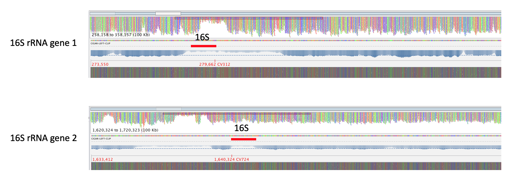
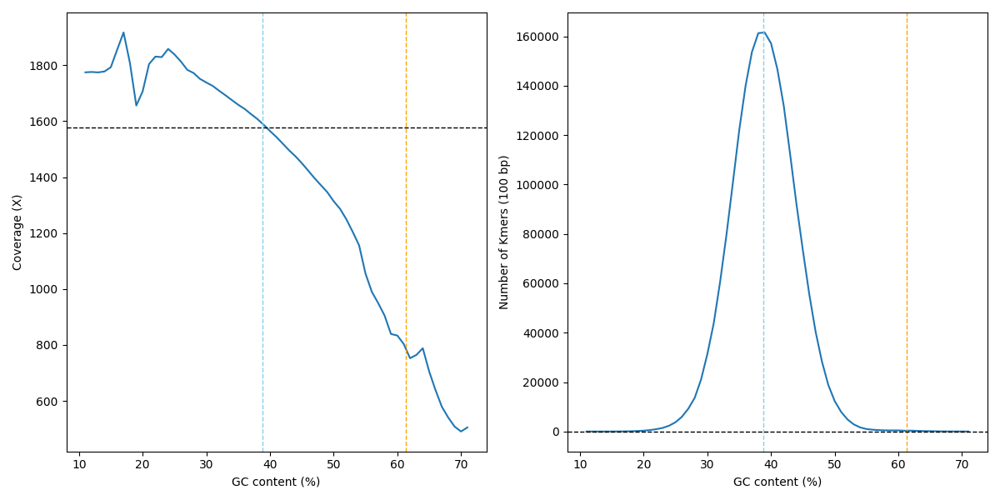

GC content bias
---

Read coverage of MAGs and their linked 16S rRNA genes might be biased by guanine-cytosine (GC) content [[Reference](https://doi.org/10.1093/nar/gks001)].
Read coverage are weighted by GC content bias before estimating the copy number of 16S rRNA genes in MAGs. 
GC content bias is calculated as described [here](https://support.illumina.com/content/dam/illumina-support/help/Illumina_DRAGEN_Bio_IT_Platform_v3_7_1000000141465/Content/SW/Informatics/Dragen/GCBiasReport_fDG.htm). 
An example of GC content bias from the MBARC-26 dataset that we used for benchmarking MarkerMAG is provided below.

#### Read coverage at the 16S rRNA gene regions of the Fervidobacterium pennivorans genome from the [MBARC-26](https://doi.org/10.1038/sdata.2016.81) dataset

The GC content for the two 16S rRNA genes in the genomes of Fervidobacterium pennivorans is 61.35%, which is much higher than the average GC content of the entire genomes (38.5%).

The two figures below were obtained by mapping the quality-filtered paired short reads to the completed reference genome, 
from which you can see that read coverage (sequencing depth) of the 16S rRNA gene regions (maybe also the entire rRNA operon) is much lower than the flanking regions.

#### GC bias report for this genome

+ Vertical blue line:		          Average GC content of the Genome
+ Vertical orange line: 	          Average GC content of the two 16S rRNA genes
+ Horizontal black line (left panel): Average read coverage of the genome 
