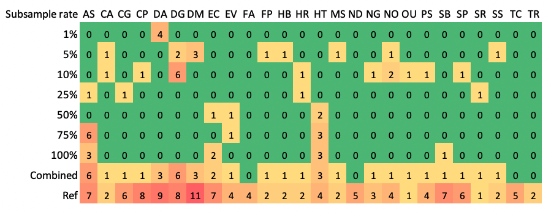

Manual for the `matam_16s` module
---

The reconstruction of 16S rRNA genes using Matam is affected by sequencing depth (Figure below), we thus recommend 
to perform the reconstruction with random subset (e.g. 1, 5, 10, 25, 50, 75 and 100%) of the metagenomic reads, followed 
with dereplication (e.g. at 99% identity) of the resulting 16S rRNA gene.

**Figure** Take the mock dataset MBARC-26 as an example. This Figure shows the number of 16S rRNA genes (>= 1200 bp) recovered at different subsample rates. 
The IDs for the reference genomes are provided on the top. 
The “combined” row shows the sum of all 16S rRNA genes reconstructed at different subsample rates after dereplication at 99% identity. 
Copy number of 16S rRNA genes in reference genomes are provided in the bottom row.

### Dependencies
 [SortMeRNA](https://github.com/biocore/sortmerna), 
 [MATAM](https://github.com/bonsai-team/matam),
 [Usearch](https://www.drive5.com/usearch/) and 
 [seqtk](https://github.com/lh3/seqtk)

### Notes

1. :warning: Same as the `link` module, the `matam_16s` module also assumes the id of reads in pair in the format of `XXXX.1` and `XXXX.2`. The only difference is the last character.
   You can rename your reads with MarkerMAG's `rename_reads` module ([manual](README_rename_reads.md)). 

1. The following command extracts 16S rRNA reads and subsample them at rates of 1, 5, 10, 25, 50, 75 and 100%.
   16S rRNA gene sequences reconstructed from all subsets are combined and clustered at identity cut-off of 99%.
   The longest sequence from each cluster will be kept.
 
       MarkerMAG matam_16s -p soil -r1 soil_R1.fastq -r2 soil_R2.fastq -pct 1,5,10,25,50,75,100 -i 0.99 -d /srv/scratch/z5039045/DB/SILVA/SILVA_138_1_SSURef_NR99_id99/SILVA_138.1_SSURef_NR99_tax_silva_NR99 -t 12

1. :warning: The default SILVA SSU database used by Matam is the [128 release](https://www.arb-silva.de/documentation/release-128/). 
   If you want to run Matam with the latest release of the SILVA SSU database, please refer to the steps below.

1. :warning: Reconstruct 16S with Matam is time-consuming (especially with multiple times of subsampling), so be patient! 

### Prepare Matam database with the latest SILVA SSU database (v138.1)

1. Download SILVA SSU sequences (v138.1)

       # specify a location where you want to store the db files
       matam_db_folder='/srv/scratch/z5039045/DB/Matam'

       # download the SILVA SSU sequence file to the specified folder and decompress it
       cd $matam_db_folder
       wget https://www.arb-silva.de/fileadmin/silva_databases/release_138_1/Exports/README.txt
       wget https://www.arb-silva.de/fileadmin/silva_databases/release_138_1/Exports/SILVA_138.1_SSURef_NR99_tax_silva.fasta.gz
       gunzip SILVA_138.1_SSURef_NR99_tax_silva.fasta.gz

1. Format SILVA SSU sequences with Matam

       matam_db_folder='/srv/scratch/z5039045/DB/Matam'
       cd $matam_db_folder
       matam_db_preprocessing.py --clustering_id_threshold 0.99 --max_memory 30000 --cpu 12 -v -i SILVA_138.1_SSURef_NR99_tax_silva.fasta -d SILVA_138_1_SSURef_NR99_id99

1. The generated db files need to be provided to Matam as `-d $matam_db_folder/SILVA_138_1_SSURef_NR99_id99/SILVA_138.1_SSURef_NR99_tax_silva_NR99`. Here is an example command:

       # run matam directly
       matam_db_folder='/srv/scratch/z5039045/DB/Matam'
       matam_assembly.py -i filtered_reads_R1_R2.fastq -o Matam_outputs -d $matam_db_folder/SILVA_138_1_SSURef_NR99_id99/SILVA_138.1_SSURef_NR99_tax_silva_NR99 -v --cpu 12 --max_memory 30000 
       
       # run matam with matam_16s
       matam_db_folder='/srv/scratch/z5039045/DB/Matam'
       MarkerMAG matam_16s -p soil -r1 soil_R1.fastq -r2 soil_R2.fastq -pct 1,5,10,25,50,75,100 -i 0.999 -d $matam_db_folder/SILVA_138_1_SSURef_NR99_id99/SILVA_138.1_SSURef_NR99_tax_silva_NR99 -t 12
